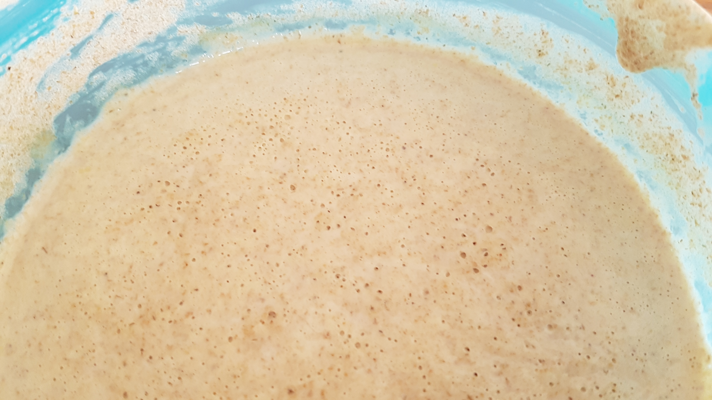
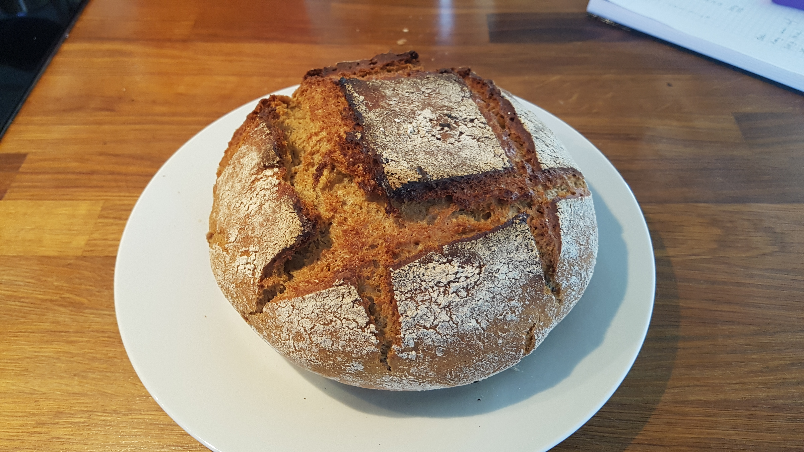
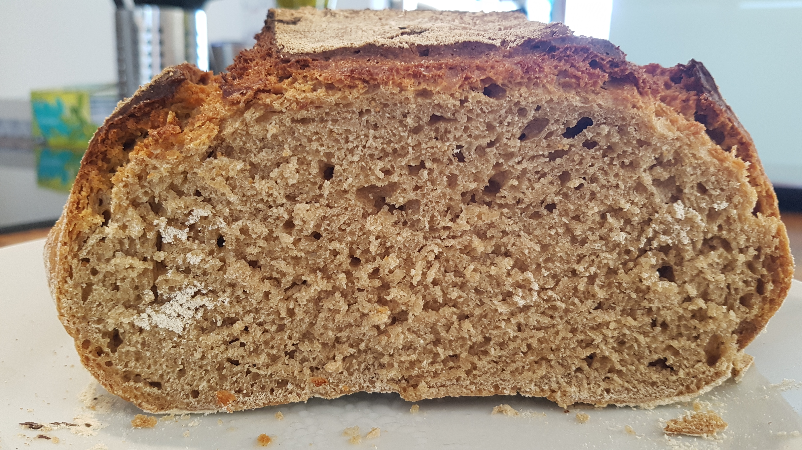

# pain-levain

## J-8 : Faire son levain

Le levain était originellement la seule manière de faire lever le pain. Il se substitue donc à la levure dans la confection du pain.

Le levain est un mélange de farine complète et d'eau dans lequel vont se développer des bactéries/levures. Il s'agit donc de créer un milieu favorable à leur culture.

### Ingrédients
* 400g de farine complète. De la farine de petit épautre T110 bio pour moi.
* 500g d'eau en bouteille. L'eau du robinet est à proscrire car le chlore qu'elle contient risque de tuer les bactéries.
* 1 c.à.c de sucre.

### Faire son levain chef

| Jour | Eau  | Farine | Commentaire |
| ---- | ---- | ------ | --- |
| 1    | 200g | 100g   | Ajouter une c.à.c de sucre |
| 2    | 50g  | 50g    | |
| 3    | 50g  | 50g    | |
| 4    | 50g  | 50g    | |
| 5    | 50g  | 50g    | Poser un torchon sur le récipient |
| 6    | 50g  | 50g    | |
| 7    | 50g  | 50g    | |

* Le premier jour, ajouter dans un récipient 200g d'eau, 100g de farine et une c.à.c de sucre ; et laisser ce récipient à l'air libre, dans un endroit plutôt chaud (la cuisine). Privilégier un récipient en verre ou en bois (à défaut en plastique) à un récipient en métal.
* Bien mélanger pour obtenir une préparation assez liquide et homogène. Idéalement, utiliser un ustensile en bois.
* On ajoutera,chaque jour et pendant 6 jours, 50g d'eau et 50g de farine. On *rafraîchit* le levain.
* Au 7e jour le levain est prêt à être utiliser. C'est le *levain chef*. Celui dans lequel on viendra piocher ensuite pour faire du pain.
* Conservez ensuite votre levain au frigo.

### A tester

* Utiliser de l'eau bouillie plutôt qu'en bouteille.
* Seulement 100g d'eau le jour 1. En effet cette première version du levain chef est assez liquide, ce qui s'estompe par la suite.

## J-1 : Prélever du levain

* Prélever 100g de levain chef stocké au frigo.
* Ajouter 105g de farine complète et 105g d'eau en bouteille.
* Mélanger jusqu'à obtenir une pâte liquide très homogène.
* Laisser à l'air libre sans couvrir jusqu'au lendemain.

## J : Rendre au levain chef

* Remettre 110g de ce nouveau levain dans le levain chef (on vient en fait remettre ce qu'on a pris, plus un petit peu en plus pour compenser les pertes) et mettre de côté les 200g de levain restant.

## J : Confectionner le pain

### Autolyse

* Mélanger 700g de farine et 325g d'eau jusqu'à obtenir un mélange homogène pas trop collant.

* Laisser reposer 40 minutes en couvrant avec un torchon humide. C'est l'autolyse. Elle permet de rendre la pâte plus extensible et donc plus facile à travailler ensuite.

### Pétrissage
* Ajouter les 200g de levain mis de côté, ainsi qu'une dizaine de tours de moulin à sel.
* Bien homogénéiser. C'est très collant donc très pénible.
* Bien fariner le plan de travail.
* Verser la pâte sur le plan de travail.
* Pendant 5/10 minutes on réalise la manipulation suivante : tirer sur un côté de la pâte et la rabattre au centre sans "déchirer" la pâte, puis tourner un peu la pâte et recommencer.
* Si la pâte est trop collante, remettre de la farine sur le plan de travail
* Une fois ceci terminé, mettre la pâte dans un gros récipient, couvert d'un torchon humide, et laisser reposer pendant 4h.

### Formage
* Placer la pâte sur le plan de travail bien fariné.
* Rabattre les côtés vers le centre délicatement quelques fois.
* Retourner la pâte et lui donner une belle forme circulaire.
* Placer la pâte dans un plat qui peut accueillir un couvercle (Ultra Pro de Tupperware pour moi).

## J : Cuire le pain
* Faire préchauffer le four au max (250°C pour moi).
* Inciser la pâte assez profondément (0,5cm à 1cm de profondeur).
* Enfourmer la pâte dans son plat couvert et laisser cuire 45 minutes à 230°C.

